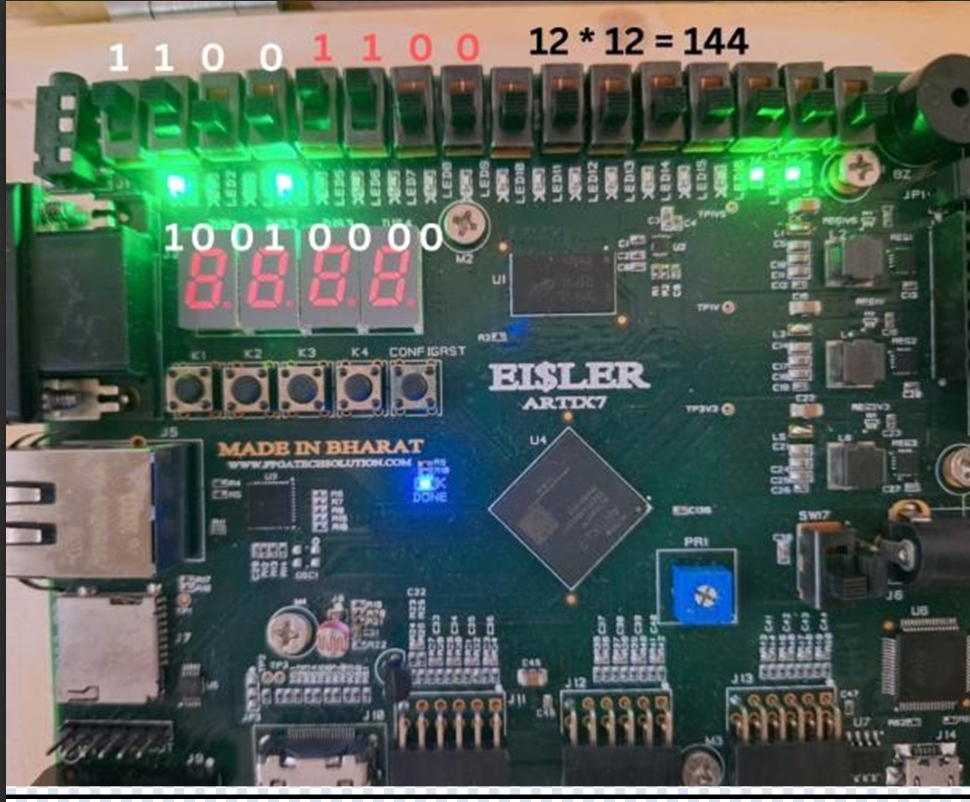
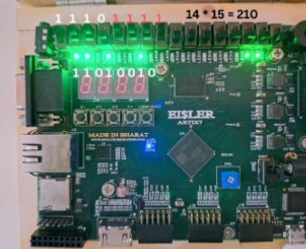

# 4-Bit Vedic Multiplier — Artix-7 FPGA

A **4×4 Vedic Multiplier** implemented in **Verilog HDL** using the **Urdhva Tiryagbhyam** algorithm, synthesized and validated on an **Artix-7 FPGA** via Xilinx Vivado.

---

## How It Works

The two 4-bit inputs are split into 2-bit halves. Four **2×2 Vedic Multiplier** sub-modules compute partial products in parallel, which are then summed using **Half Adders** to produce the final 8-bit output. This parallel approach reduces propagation delay compared to conventional multipliers.

```
A[3:0], B[3:0]  →  4× (2×2 Vedic Multipliers)  →  Half Adder Accumulation  →  Product[7:0]
```

### Example

| Input A | Input B | Product |
|---------|---------|---------|
| 1010 (10) | 0101 (5) | 00110010 (50) |
| 1111 (15) | 1111 (15) | 11100001 (225) |

---

## Hardware Validation

Tested on the **Eisler Artix-7 FPGA Board (XC7A35T)**. Slide switches set the inputs; LEDs display the 8-bit product.

**12 × 12 = 144 (`10010000`)**



**14 × 15 = 210 (`11010010`)**



---

## Project Structure

```
vedic_multiplier/
├── README.md              # Project documentation
├── artix7.xdc             # Pin and timing constraints (Artix-7)
├── half_adder.v           # Half adder primitive
├── vedic_2x2.v            # 2×2 Vedic sub-multiplier
├── vedic_4x4.v            # 4×4 Vedic multiplier core
├── vedic_4bit_top.v       # Top-level module (scalar I/O pins)
├── tb_vedic_4x4.v         # Exhaustive testbench (all 256 input combos)
├── Hardware Result 12*12.png   # Board photo — 12×12=144
└── Hardware Result 14*15.png   # Board photo — 14×15=210
```

---

## Tools & Technologies

| Category | Details |
|----------|---------|
| HDL | Verilog (IEEE 1364-2001) |
| Toolchain | Xilinx Vivado Design Suite |
| Target Device | Artix-7 (xc7a35t) |
| Verification | Functional simulation — all 256 input combinations passed |

---

## How to Run

1. Clone the repo and open the project in **Xilinx Vivado**
2. Add all `.v` files as sources and `artix7.xdc` as a constraint
3. **Simulate:** Flow Navigator → Run Behavioral Simulation
4. **Synthesize & Implement:** Flow Navigator → Run Synthesis → Run Implementation
5. **Deploy:** Generate Bitstream → Connect board → Program Device
